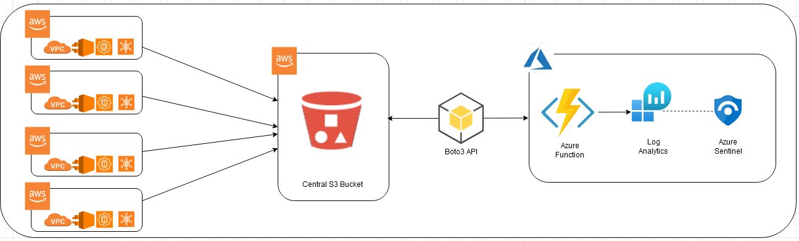

# Azure Sentinel Data connector to ingest AWS S3 Files using Azure Monitor Data Collection Endpoint
**Author: Sreedhar Ande**  

Azure Sentinel Data connector to ingest AWS S3 Files using Azure Monitor DCE. This Data connector currently support the following file types from AWS S3  

 - .json.gz    
 - .jsonl.gz  
 - .json  
 - .csv.gz
 - .log.gz

## **Function Flow process**
**.json.gz/.jsonl.gz/.json/.csv.gz/.log.gz --> AWS S3 --> Azure Function --> Azure Log Analytics**  
  

## Pre-requisites  
1.	Register an Azure Active Directory application to authenticate against the API  
	https://docs.microsoft.com/azure/azure-monitor/logs/tutorial-custom-logs#configure-application  
	
2. Create Data Collection Endpoint (DCE) on Azure Monitor  
	https://docs.microsoft.com/azure/azure-monitor/logs/tutorial-custom-logs#create-data-collection-endpoint  
	
3. Create Customlog Table
	https://docs.microsoft.com/azure/azure-monitor/logs/tutorial-custom-logs#add-custom-log-table  
	
4. Create Data Collection Rule (DCR)  
   https://docs.microsoft.com/azure/azure-monitor/logs/tutorial-custom-logs-api#create-data-collection-rule

5. Collect DCR-ImmutableId  
	https://docs.microsoft.com/azure/azure-monitor/logs/tutorial-custom-logs#collect-information-from-dcr  
	
6. Assign Permissions to Data Collection Rule(DCR)  
	https://docs.microsoft.com/azure/azure-monitor/logs/tutorial-custom-logs-api#assign-permissions-to-dcr  

## Installation / Setup Guide

1. Click  "Deploy To Azure" (For both Commercial & Azure GOV)  
[](https://portal.azure.com/#create/Microsoft.Template/uri/https%3A%2F%2Fraw.githubusercontent.com%2FAzure%2FAzure-Sentinel%2Fmaster%2FDataConnectors%2FAWS-S3-AzureFunction%2Fazuredeploy_awss3.json)
[](https://portal.azure.us/#create/Microsoft.Template/uri/https%3A%2F%2Fraw.githubusercontent.com%2FAzure%2FAzure-Sentinel%2Fmaster%2FDataConnectors%2FAWS-S3-AzureFunction%2Fazuredeploy_awss3.json)

2. Select the preferred **Subscription**, **Resource Group** and **Location**  
   **Note**  
   Best practice : Create new Resource Group while deploying - all the resources of your custom Data connector will reside in the newly created Resource 
   Group
3. Enter the following value in the ARM template deployment
	```	
	"Azure Tenant Id": Azure Tenant Id​
	"AAD Application Id": AAD Application Id
	"AAD Application Secret": AAD Application Secret
	"Azure Monitor Dce Uri": Azure Monitor Data Collection end point
	"Azure Monitor Dcr Immutable Id": Azure Monitor Dcr Immutable Id
	"AWS Access ID": AWS Access Key
	"AWS Secret Key ID": AWS Secret Key
	"AWS Region Name" : AWS Region
	"S3 Bucket": AWS S3 Bucket URI  
	  - Ex: s3://<<S3 Bucket Name>>/AWSLogs/
	"S3FolderName" : Folder Name in AWS Account folder in S3
	  - Ex: CloudTrail/GuardDuty/SecurityHub/DNSLogs  
	"AWS Logs Table Name": Azure Log Analytics Custom Log Table Name		
	```

## Post Deployment Steps

1. The `TimerTrigger` makes it incredibly easy to have your functions executed on a schedule. This sample demonstrates a simple use case of calling your function based on your schedule provided while deploying. If the time interval needs to be modified, it is recommended to change the Function App Timer Trigger accordingly update environment variable **"Schedule**" (post deployment) to prevent overlapping data ingestion.
   ```
   a.	Go to your Resource Group --> Click on Function App `<<functionappname>><<uniqueid>>`
   b.	Click on Function App "Configuration" under Settings 
   c.	Click on "Schedule" under "Application Settings"
   d.	Update your own schedule using cron expression.
   ```
   **Note: For a `TimerTrigger` to work, you provide a schedule in the form of a [cron expression](https://en.wikipedia.org/wiki/Cron#CRON_expression)(See the link for full details). A cron expression is a string with 6 separate expressions which represent a given schedule via patterns. The pattern we use to represent every 10 minutes is `0 */10 * * * *`. This, in plain text, means: "When seconds is equal to 0, minutes is divisible by 10, for any hour, day of the month, month, day of the week, or year".**
   
 
2. Parameterized AWS S3 fresh event duration using environment variable "FreshEventTimeStamp". Value must be in minutes.  
   **Note**  
   **Azure Function trigger Schedule and FreshEventTimeStamp should match to avoid duplicates**  
   Ex: If you want to trigger function every 10 min then values must be  
   FreshEventTimeStamp=10    
   Schedule=0 */10 * * * *  
      
4. AWSAccessKey, AWSSecretAccessKey will be placed as "Secrets" in the Azure KeyVault `<<functionappname>><<uniqueid>>` with only Azure Function access policy. If you want to see/update these secrets,

	```
		a. Go to Azure KeyVault "<<functionappname>><<uniqueid>>"
		b. Click on "Access Policies" under Settings
		c. Click on "Add Access Policy"
			i. Configure from template : Secret Management
			ii. Key Permissions : GET, LIST, SET
			iii. Select Prinicpal : <<Your Account>>
			iv. Add
		d. Click "Save"

	```
